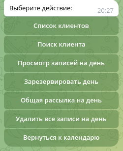
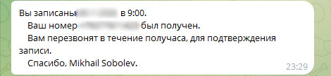

# Инструкция телеграм-бота "bot_service_appointment".
## Краткое описание:
Я рады представить вам наш телеграмм-бот для записи на приём - инновационное решение, которое поможет значительно упростить и улучшить процесс записи на приём в вашей организации.

Мой телеграмм-бот предлагает ряд высокоэффективных функций, включая:

1. Онлайн-запись на приём: Ваши клиенты смогут легко и быстро записаться на приём через телеграмм, без необходимости звонить или приходить лично.
2. Уведомления и напоминания: Бот будет автоматически отправлять уведомления и напоминания клиентам о предстоящем приёме, снижая вероятность пропуска и отмены встреч.
3. Простота использования: Мой телеграмм-бот разработан с учетом удобства использования и интуитивно понятного интерфейса, что позволяет вашим клиентам быстро освоить его.

### Запуск на Windows (при установленном python):
Открываем терминал, переходим в корневую папку с ботом
1. Создаём окружение ```python -m venv venv```
2. Активируем окружение ```venv\Scripts\activate.bat```
3. Устанавливаем зависимости ```FOR /F %x IN (requirements.txt) DO ( IF NOT # == %x ( pip install %x ) )```
4. Переименовываем файл .env.template в .env . Заполняем поле токен-бота и остальные поля.
5. Запускаем командой из терминала ```python main.py```

### Запуск на Linux (при установленном python):
Открываем терминал, переходим в корневую папку с ботом
1. Создаём окружение ```python3 -m venv venv```   
2. Активируем окружение source ```source venv/bin/activate```
3. Устанавливаем зависимости ```pip install -r requirements.txt```
4. Переименовываем файл .env.template в .env и заполняем все поля.
5. Запускаем командой из терминала ```python3 main.py```

### Запуск через Docker-compose:
Открываем терминал, переходим в корневую папку с ботом
1. Создаём образ командой ```docker-compose build```
2. Поднимаем контейнер ```docker-compose up```

---
Внимание!!! Если произошла ошибка при запуске, сверьте версии библиотек.
---
---

## Инструкция по работе администратором.



```
    "Список клиентов" - просмотреть полный список клиентов (просмотреть их записи, заблокировать, удалить).
    "Поиск клиентов" - поиск клиент по имени, фамилии, номеру телефона.
    "Просмотр записей на день" - просмотреть кто записан на выбранный день.
    "Зарезервировать день" - зарезервировать день (ранее записи клиентов удаляются и оповещаются, что запись аннулирована).
    "Общая рассылка на день" - рассылка сообщений всех клиентам кто записан на выбранный день.
    "Удалить все записи на день" - удаляется все записи на выбранный день.
    "Вернуться к календарю" - вернуться к календарю
```
---
## Инструкция по работе клиентом.

### Записаться на приём:

1. Выбираете удобную для себя дату


2. Далее появляется список свободного времени. Укажите удобное время


3. Отправьте с ботом своим номером телефона


4. Получите уведомление о записи



### Удалить запись на приём:

Так же есть возможность просмотреть свои записи и при не обходимости удалить.
Нажмите на кнопку "Мои записи".  Бот выведет список ваших записей, нажмите на ту которая больше не интересна и подтвердите удаление.


